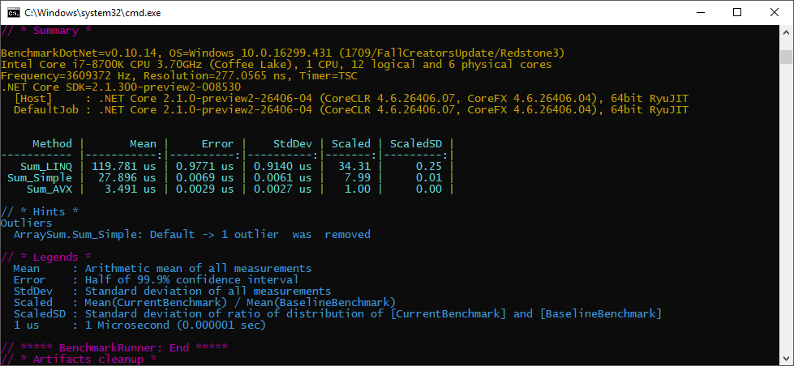
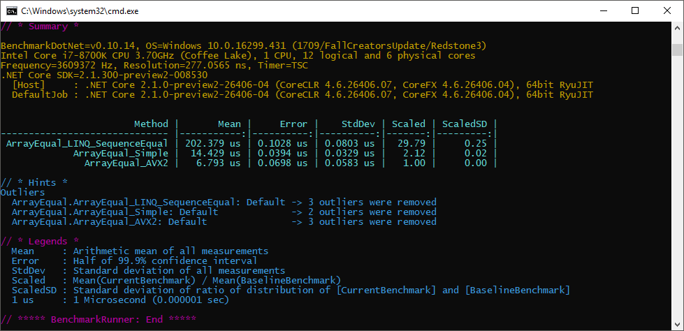
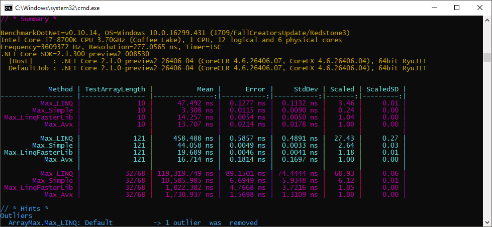
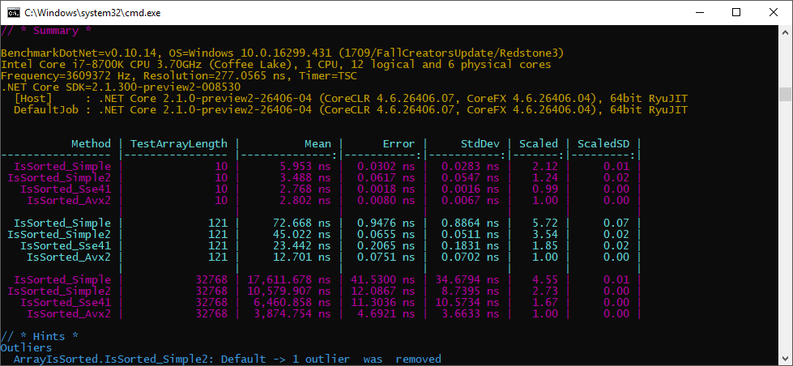
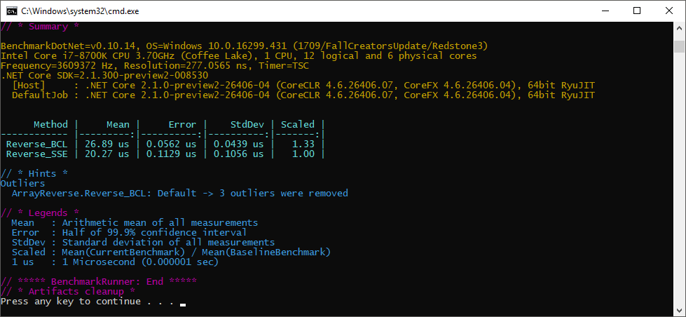

# IntrinsicsPlayground

My toys to play with intrinsics in pure C# (see `System.Runtime.Intrinsics.Experimental`)

**1. ArraySum**

Sum of elements in an array of floats 

**2. ArrayEqual**

Are arrays of doubles equal?

**3. ArrayMax**

Max element in an array of ints 

**4. ArrayIsSorted**

Check if an array is sorted or not

**5. ArrayReverse**

Reverse all elements in an array

