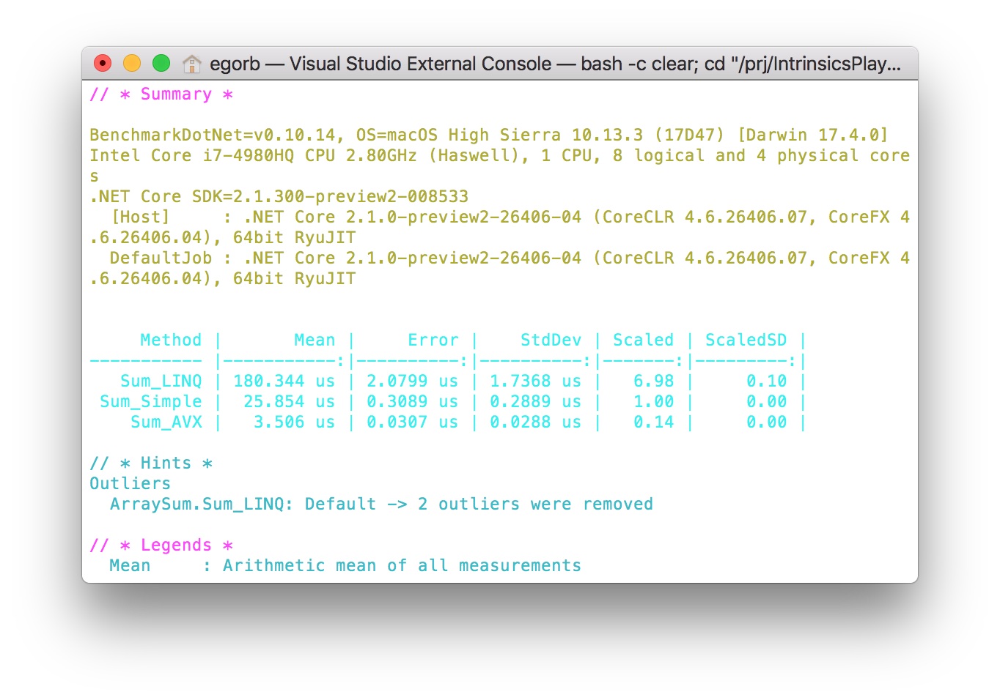
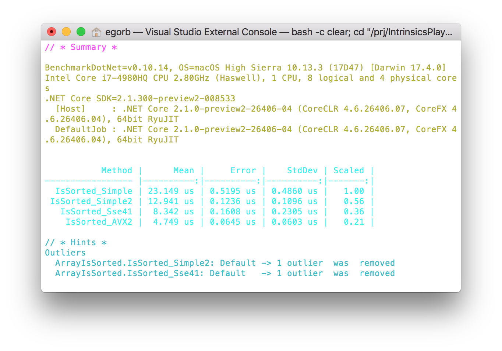
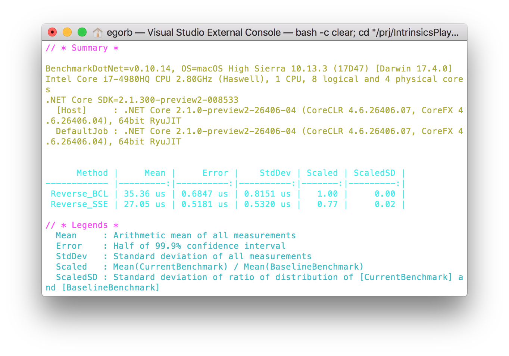
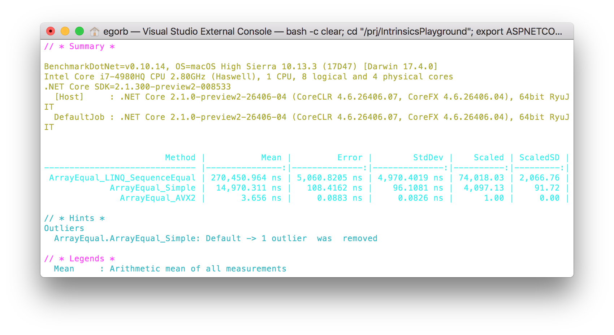

# IntrinsicsPlayground

My toys to play with intrinsics in pure C# (see `System.Runtime.Intrinsics.Experimental`)

**1. ArraySum**
Find sum of elements in an array of floats 

**2. ArrayMax**
Find max element in an array of ints 

**3. ArrayIsSorted**
Check if an array is sorted or not

**4. ArrayReverse**
Reverse all elements in an array

**5. ArrayEqual**
Are arrays equal?
**WRONG! TODO: fix**

