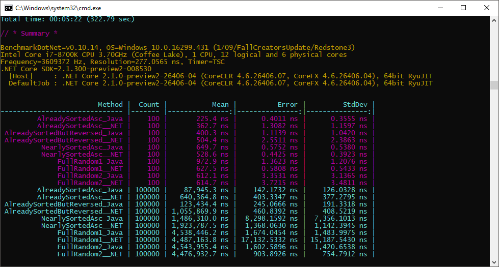

# IntrinsicsPlayground

My toys to play with intrinsics in pure C# (see `System.Runtime.Intrinsics.Experimental`)

**1. ArraySum**

Sum of elements in an array of floats 
`var sum = arrayOfFloats.Sum();`

|            Method | TestArrayLength |           Mean |         Error |        StdDev | Scaled |
|------------------ |---------------- |---------------:|--------------:|--------------:|-------:|
|          **Sum_LINQ** |              **10** |      **68.007 ns** |     **1.3892 ns** |     **1.9015 ns** |   **5.33** |
|        Sum_Simple |              10 |       4.926 ns |     0.0801 ns |     0.0750 ns |   0.39 |
| Sum_LinqFasterLib |              10 |      20.665 ns |     0.1016 ns |     0.0848 ns |   1.62 |
|           Sum_Avx |              10 |      12.757 ns |     0.0690 ns |     0.0612 ns |   1.00 |
|                   |                 |                |               |               |        |
|          **Sum_LINQ** |             **121** |     **646.813 ns** |     **5.3427 ns** |     **4.7361 ns** |  **31.92** |
|        Sum_Simple |             121 |      80.691 ns |     0.7946 ns |     0.7433 ns |   3.98 |
| Sum_LinqFasterLib |             121 |      32.656 ns |     0.3420 ns |     0.3199 ns |   1.61 |
|           Sum_Avx |             121 |      20.263 ns |     0.1625 ns |     0.1520 ns |   1.00 |
|                   |                 |                |               |               |        |
|          **Sum_LINQ** |           **32768** | **169,085.710 ns** | **3,192.3564 ns** | **2,986.1319 ns** |  **44.67** |
|        Sum_Simple |           32768 |  25,109.373 ns |   292.4024 ns |   273.5133 ns |   6.63 |
| Sum_LinqFasterLib |           32768 |   3,826.928 ns |    23.8574 ns |    22.3162 ns |   1.01 |
|           Sum_Avx |           32768 |   3,784.930 ns |    13.6422 ns |    11.3918 ns |   1.00 |

**2. ArrayEqual**

Are arrays of floats equal?
`var equal = arrayOfFloats1.SequenceEqual(arrayOfFloats2);`

|            Method | TestArrayLength |           Mean |         Error |         StdDev |         Median | Scaled |
|------------------ |---------------- |---------------:|--------------:|---------------:|---------------:|-------:|
|   **ArrayEqual_LINQ** |              **10** |     **233.546 ns** |     **5.6352 ns** |     **16.6155 ns** |     **231.758 ns** |  **38.74** |
| ArrayEqual_Simple |              10 |      10.013 ns |     0.2982 ns |      0.8794 ns |       9.884 ns |   1.66 |
|   ArrayEqual_AVX2 |              10 |       6.045 ns |     0.1606 ns |      0.3206 ns |       5.903 ns |   1.00 |
|                   |                 |                |               |                |                |        |
|   **ArrayEqual_LINQ** |             **121** |   **1,345.860 ns** |    **31.4483 ns** |     **92.7261 ns** |   **1,299.326 ns** |  **60.32** |
| ArrayEqual_Simple |             121 |     100.944 ns |     2.2744 ns |      6.7062 ns |     100.224 ns |   4.52 |
|   ArrayEqual_AVX2 |             121 |      22.387 ns |     0.4808 ns |      1.3161 ns |      21.822 ns |   1.00 |
|                   |                 |                |               |                |                |        |
|   **ArrayEqual_LINQ** |           **32768** | **334,854.912 ns** | **8,560.6498 ns** | **25,241.2691 ns** | **322,131.934 ns** |  **50.67** |
| ArrayEqual_Simple |           32768 |  23,460.582 ns |   723.2722 ns |  2,132.5844 ns |  22,767.616 ns |   3.55 |
|   ArrayEqual_AVX2 |           32768 |   6,626.225 ns |   132.1248 ns |    354.9447 ns |   6,545.398 ns |   1.00 |

**3. ArrayMax**

Max element in an array of ints 
`var max = arrayOfInts.Max();`

|            Method | TestArrayLength |           Mean |         Error |         StdDev |         Median | Scaled |
|------------------ |---------------- |---------------:|--------------:|---------------:|---------------:|-------:|
|          **Max_LINQ** |              **10** |      **71.186 ns** |     **1.7691 ns** |      **5.2163 ns** |      **69.342 ns** |   **3.97** |
|        Max_Simple |              10 |       6.910 ns |     0.2361 ns |      0.6962 ns |       6.608 ns |   0.39 |
| Max_LinqFasterLib |              10 |      19.458 ns |     0.5097 ns |      1.5029 ns |      19.138 ns |   1.08 |
|           Max_Avx |              10 |      18.046 ns |     0.4834 ns |      1.4253 ns |      17.442 ns |   1.00 |
|                   |                 |                |               |                |                |        |
|          **Max_LINQ** |             **121** |     **679.652 ns** |    **15.8461 ns** |     **46.7227 ns** |     **657.340 ns** |  **28.59** |
|        Max_Simple |             121 |      64.353 ns |     1.7576 ns |      5.1825 ns |      61.552 ns |   2.71 |
| Max_LinqFasterLib |             121 |      28.253 ns |     0.7625 ns |      2.2481 ns |      28.120 ns |   1.19 |
|           Max_Avx |             121 |      23.884 ns |     0.5643 ns |      1.6639 ns |      23.604 ns |   1.00 |
|                   |                 |                |               |                |                |        |
|          **Max_LINQ** |           **32768** | **175,971.956 ns** | **4,574.6161 ns** | **13,488.3588 ns** | **170,108.569 ns** |  **84.17** |
|        Max_Simple |           32768 |  14,003.368 ns |   338.6551 ns |    998.5322 ns |  13,815.791 ns |   6.70 |
| Max_LinqFasterLib |           32768 |   2,731.388 ns |    69.6229 ns |    205.2848 ns |   2,684.618 ns |   1.31 |
|           Max_Avx |           32768 |   2,096.625 ns |    44.3452 ns |    116.8231 ns |   2,051.308 ns |   1.00 |

**4. ArrayIsSorted**

Check if an array is sorted or not

|                    Method | TestArrayLength |          Mean |       Error |        StdDev |        Median | Scaled |
|-------------------------- |---------------- |--------------:|------------:|--------------:|--------------:|-------:|
|           **IsSorted_Simple** |              **10** |      **8.461 ns** |   **0.2546 ns** |     **0.7506 ns** |      **8.242 ns** |   **2.19** |
| IsSorted_Simple_Optimized |              10 |      5.883 ns |   0.1792 ns |     0.5285 ns |      5.891 ns |
|            IsSorted_Sse41 |              10 |      4.639 ns |   0.1476 ns |     0.4352 ns |      4.457 ns |
|             IsSorted_Avx2 |              10 |      3.888 ns |   0.1128 ns |     0.3327 ns |      3.790 ns |
|                           |                 |               |             |               |               |
|           **IsSorted_Simple** |             **121** |    **100.358 ns** |   **2.2953 ns** |     **6.7677 ns** |     **99.034 ns** |   **5.23** |
| IsSorted_Simple_Optimized |             121 |     63.780 ns |   1.4354 ns |     4.2324 ns |     63.710 ns |
|            IsSorted_Sse41 |             121 |     34.553 ns |   1.0334 ns |     1.0149 ns |     34.161 ns |
|             IsSorted_Avx2 |             121 |     19.291 ns |   0.4665 ns |     1.3756 ns |     18.773 ns |
|                           |                 |               |             |               |               |
|           **IsSorted_Simple** |           **32768** | **23,634.628 ns** | **468.4683 ns** | **1,028.2994 ns** | **23,267.634 ns** |   **4.60** |
| IsSorted_Simple_Optimized |           32768 | 14,169.756 ns | 337.5960 ns |   617.3134 ns | 13,940.911 ns |
|            IsSorted_Sse41 |           32768 |  8,676.964 ns | 290.3040 ns |   855.9679 ns |  8,242.768 ns |
|             IsSorted_Avx2 |           32768 |  5,176.106 ns | 143.7989 ns |   423.9943 ns |  4,969.556 ns |

**5. ArrayReverse**

Reverse all elements in an array
`Array.Reverse(arrayOfInts);`

|      Method | TestArrayLength |         Mean |      Error |      StdDev | Scaled |
|------------ |---------------- |-------------:|-----------:|------------:|-------:|
| **Reverse_BCL** |              **10** |     **77.82 ns** |   **1.082 ns** |   **0.9594 ns** |   **0.94** |
| Reverse_SSE |              10 |     82.44 ns |   1.543 ns |   1.4431 ns |   1.00 |
|             |                 |              |            |             |        |
| **Reverse_BCL** |             **121** |    **156.44 ns** |   **2.061 ns** |   **1.9278 ns** |   **1.24** |
| Reverse_SSE |             121 |    125.95 ns |   1.435 ns |   1.3424 ns |   1.00 |
|             |                 |              |            |             |        |
| **Reverse_BCL** |           **32768** | **27,924.33 ns** | **385.413 ns** | **360.5159 ns** |   **1.34** |
| Reverse_SSE |           32768 | 20,774.09 ns | 405.762 ns | 416.6872 ns |   1.00 |

**6. ArrayIndexOf**

Searche for the specified element and returns the index of its first occurrence
`int index = Array.IndexOf(arrayOfInts, element);`

|       Method | TestArrayLength |         Mean |       Error |      StdDev |       Median | Scaled |
|------------- |---------------- |-------------:|------------:|------------:|-------------:|-------:|
|  **IndexOf_BCL** |              **10** |    **11.242 ns** |   **0.2181 ns** |   **0.1934 ns** |    **11.196 ns** |   **1.61** |
| IndexOf_Avx2 |              10 |     7.059 ns |   0.2392 ns |   0.7052 ns |     6.706 ns |   1.00 |
|              |                 |              |             |             |              |        |
|  **IndexOf_BCL** |             **121** |    **51.018 ns** |   **1.1211 ns** |   **3.3056 ns** |    **49.654 ns** |   **3.98** |
| IndexOf_Avx2 |             121 |    12.928 ns |   0.3901 ns |   1.1503 ns |    12.377 ns |   1.00 |
|              |                 |              |             |             |              |        |
|  **IndexOf_BCL** |           **32768** | **8,361.998 ns** | **516.1762 ns** | **506.9540 ns** | **8,180.999 ns** |   **4.16** |
| IndexOf_Avx2 |           32768 | 2,008.645 ns |  39.2037 ns |  43.5748 ns | 2,000.140 ns |   1.00 |

**7. MatrixSum**

Add two matrices (`Matrix4x4`)
`var matrix3 = matrix1 + matrix2;`

|        Method |     Mean |     Error |    StdDev | Scaled |
|-------------- |---------:|----------:|----------:|-------:|
| MatrixSum_BCL | 29.85 us | 0.2808 us | 0.2627 us |   1.09 |
| MatrixSum_Avx | 27.36 us | 0.2033 us | 0.1901 us |   1.00 |

**8. MatrixNegate**

Negate a matrix (`Matrix4x4`)
`matrix = -matrix;`

|           Method |     Mean |     Error |    StdDev | Scaled |
|----------------- |---------:|----------:|----------:|-------:|
| MatrixNegate_BCL | 37.31 us | 0.2580 us | 0.2155 us |   1.07 |
| MatrixNegate_Avx | 34.77 us | 0.2419 us | 0.2145 us |   1.00 |

**9. MatrixMultiply**

Multiply a matrix by a vector 
`matrix = matrix * vec;`

|                      Method |     Mean |     Error |    StdDev | Scaled |
|---------------------------- |---------:|----------:|----------:|-------:|
| MatrixMultiply_ByVector_BCL | 37.67 us | 0.2273 us | 0.1898 us |   1.06 |
| MatrixMultiply_ByVector_Avx | 35.38 us | 0.4044 us | 0.3783 us |   1.00 |

# Misc

**1. Array.Sort vs DualPivotQuickSort**

Dual pivot quick sort is used in Java for primitive types (`Arrays.sort(int[])`).

