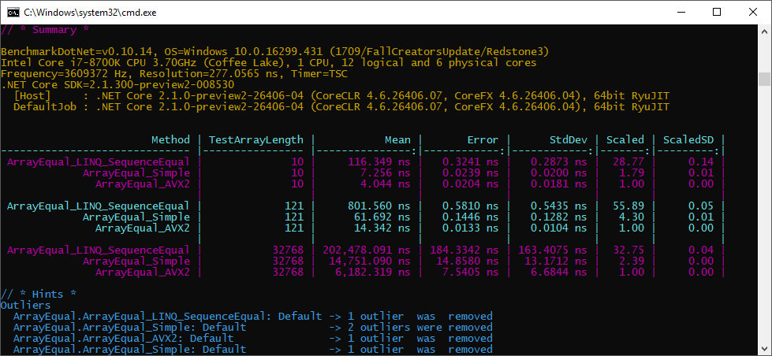
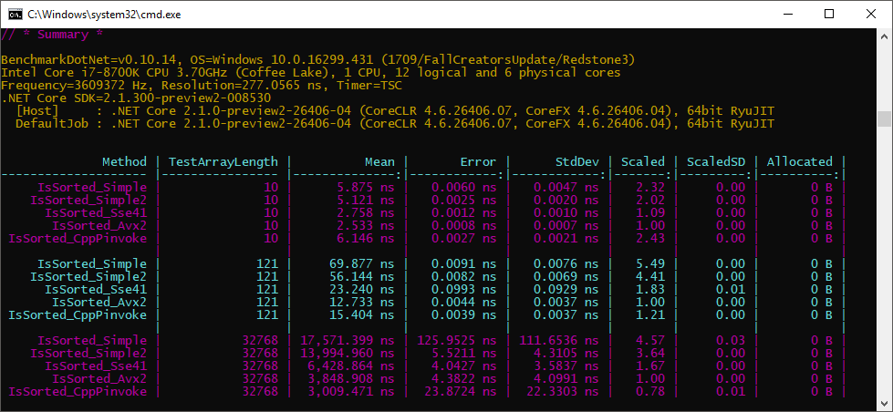

# IntrinsicsPlayground

My toys to play with intrinsics in pure C# (see `System.Runtime.Intrinsics.Experimental`)

**1. ArraySum**

Sum of elements in an array of floats 
`var sum = arrayOfFloats.Sum();`

**2. ArrayEqual**

Are arrays of floats equal?
`var equal = arrayOfFloats1.SequenceEqual(arrayOfFloats2);`

**3. ArrayMax**

Max element in an array of ints 
`var max = arrayOfInts.Max();`

**4. ArrayIsSorted**

Check if an array is sorted or not

**5. ArrayReverse**

Reverse all elements in an array
`Array.Reverse(arrayOfInts);`

**6. MatrixSum**

Add two matrices (`Matrix4x4`)
`var add = matrix1 + matrix2;`

